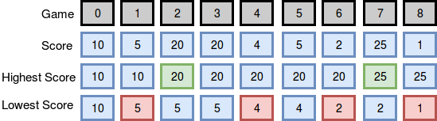
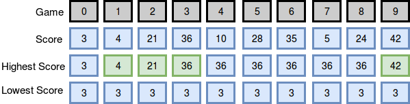

# Breaking The Records

Maria plays college basketball and wants to go pro. Each season she maintains a record of her play. She tabulates the number of times she breaks her season record for most points and least points in a game. Points scored in the first game establish her record for the season, and she begins counting from there.

For example, assume her scores for the season are represented in the array _scores_ = [12, 24, 10, 24]. Scores are in the same order as the games played. She would tabulate her results as follows:

| Game | Score | Minimum | Maximum | Min | Max |
| :---: | :---: | :---: | :---: | :---: | :---: |
| 0 | 12 | 12 | 12 | 0 | 0 |
| 1 | 24 | 12 | 12 | 0 | 1 |
| 2 | 10 | 10 | 24 | 1 | 1 |
| 3 | 24 | 10 | 24 | 1 | 1 |

Given Maria's scores for a season, find and print the number of times she breaks her records for most and least points scored during the season.

### Function Description

Complete the `breakingRecords` function in the editor below. It must return an integer array containing the numbers of times she broke her records. Index 0 is for breaking most points records, and index 1 is for breaking least points records.

`breakingRecords` has the following parameter(s):

* scores: an array of integers

### Input Format

1. The first line contains an integer _n_, the number of games. 
2. The second line contains _n_ space-separated integers describing the respective values of _score_<sub>0</sub>, _score_<sub>1</sub> ... _score_<sub>_n_-1</sub>.

### Constraints

* 1 <= _n_ <= 10000
* 0 <= _scores_[_i_] <= 10<sup>8</sup>

### Output Format

Print two space-seperated integers describing the respective numbers of times her best (highest) score increased and her worst (lowest) score decreased.

### Sample Input 0
```
9
10 5 20 20 4 5 2 25 1
```

### Sample Output 0
```
2 4
```

### Explanation 0

The diagram below depicts the number of times Maria broke her best and worst records throughout the season:



She broke her best record twice (after games 2 and 7) and her worst record four times (after games 1, 4, 6, and 8), so we print `2 4` as our answer. Note that she did not break her record for best score during game 3, as her score during that game was not strictly greater than her best record at the time.

### Sample Input 1
```
10
3 4 21 36 10 28 35 5 24 42
```

### Sample Output 1
```
4 0
```

### Explanation 1

The diagram below depicts the number of times Maria broke her best and worst records throughout the season:



She broke her best record four times (after games 1, 2, 3, and 9) and her worst record zero times (no score during the season was lower than the one she earned during her first game), so we print `4 0` as our answer.